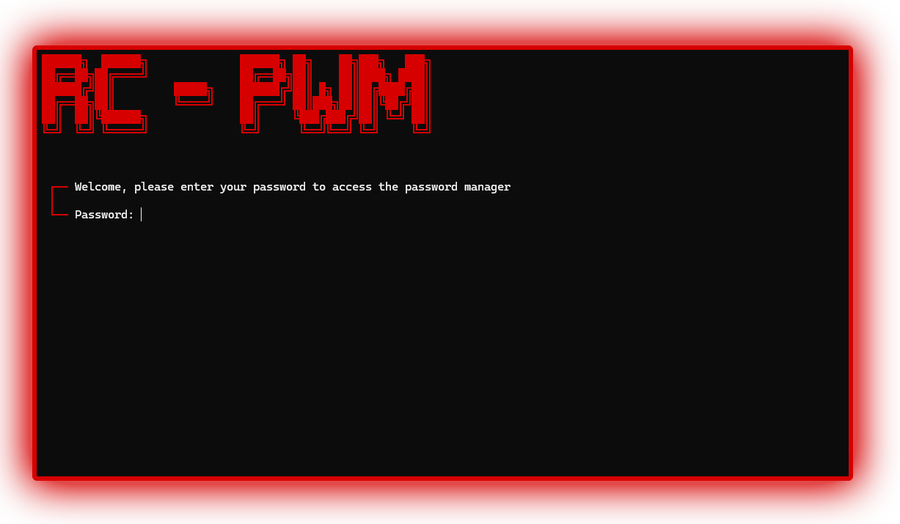
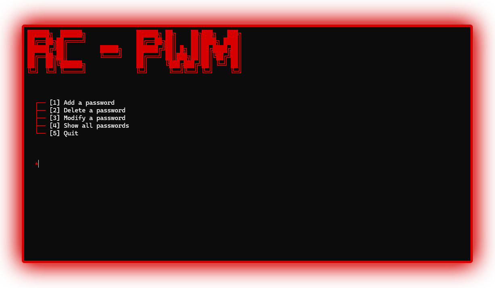
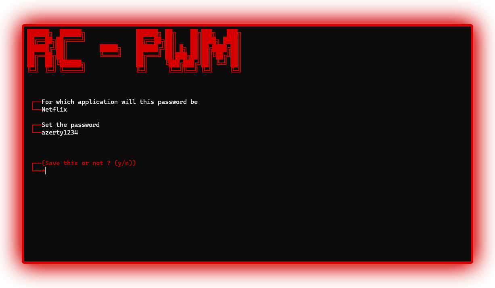
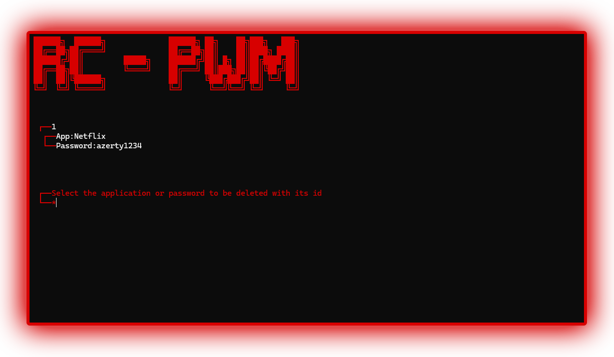
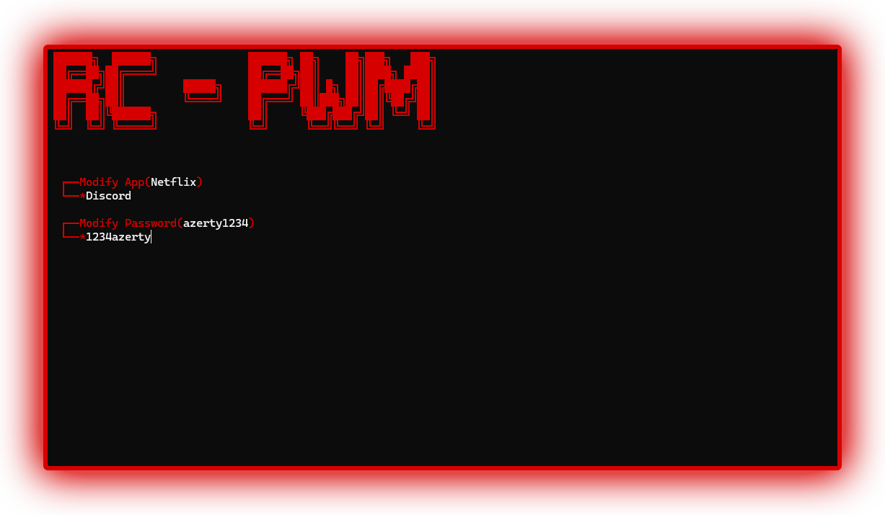

# RC-PasswordManager


RC-PasswordManager is a secure, offline password manager written in modern C++.  
It provides AES-256 encryption, machine-locked key generation, and local encrypted storage using JSON.  
No internet access is required.

---

## Features

- AES-256 encryption using CBC mode with random IV  
- Salted SHA-256 hashing for secure master password storage  
- Key derived from your master password hash + machine UUID (unique to your computer)  
- All data stored locally in JSON, encrypted and base64-encoded  
- Minimal terminal-based interface (Windows)  
- No network features, no telemetry, no dependencies bundled ✅  

---

## 📦 Requirements

You must install the following on your system manually:

- **OpenSSL** — for AES and hashing  
  → [https://www.openssl.org](https://www.openssl.org)  
- **nlohmann/json** — header-only JSON parser  
  → [https://github.com/nlohmann/json](https://github.com/nlohmann/json)

> These libraries are not included in the repository.  
> You can use [vcpkg](https://github.com/microsoft/vcpkg) or install them manually.

---

## ⚙️ Build Instructions

### 💻 Option 1: Compile with g++ (MinGW / Linux)

```bash
git clone https://github.com/yourname/RC-PasswordManager.git
cd RC-PasswordManager

g++ -std=c++17 src/*.cpp -o RCPasswordManager -lssl -lcrypto
```
> Make sure your OpenSSL and json.hpp are available in your system includes.

### 🧰 Option 2: Compile with Visual Studio

1. Open Visual Studio
2. Create an empty C++ project
3. Add all .cpp and .h files from the src/ directory
4. Open Project Properties:
   - Set Language Standard to C++17
   - Add include paths for OpenSSL and nlohmann/json
   - Link the following libraries:
       libssl.lib
       libcrypto.lib
5. Build the project in Release x64 mode

  ---

  ## 🔐 How It Works

  RC-PasswordManager uses a combination of cryptographic techniques to secure your data:

  - A **master password** is entered on first use and hashed using **SHA-256 + a unique salt**
  - The password hash is combined with your **machine UUID** and hashed again to generate a **256-bit AES key**
  - Passwords you save (for apps/sites/etc.) are encrypted using **AES-256-CBC** with a **random IV**
  - The IV is **prepended to the ciphertext** and **base64-encoded** for safe JSON storage
  - All data is stored **locally** in: `%APPDATA%\RC-PWG\`

  This approach ensures that your encrypted passwords:

  - ❌ Cannot be decrypted on another machine  
  - ❌ Cannot be decrypted without the master password  
  - ✅ Remain local and completely offline

  ---

  ## 📜 License

  MIT License — use, modify, and share freely.  
  **No warranties.**  
  See the `LICENSE` file for full details.

  ---

  ## 🤝 Contributing

  Pull requests are welcome!

  If you have ideas for:
  - new features 🧩
  - UI improvements 🎨
  - cross-platform support 🐧

  Feel free to **fork the project** and open an issue or a pull request.

  ## Preview

  
  
  
  
  
